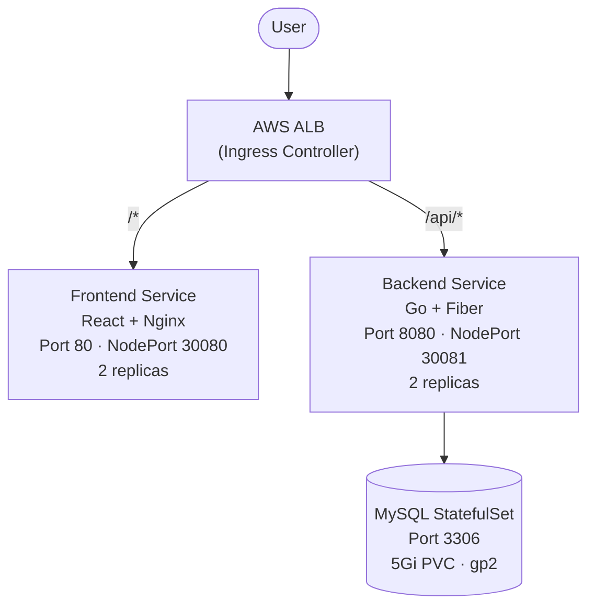
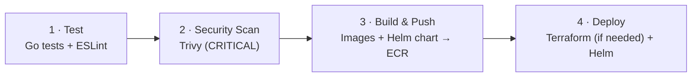

<div align="center">

# 🛍️ ShopVerse

**A production-ready, full-stack e-commerce platform on AWS EKS**

[](#-cicd-pipeline)
[](#-tech-stack)
[](#-tech-stack)
[](#-tech-stack)
[](#-aws-deployment)
[](#step-2--provision-infrastructure-with-terraform)
[](#-cicd-pipeline)
[](#-license)


</div>

---

## 📑 Table of Contents

- [Overview](#-overview)
- [Architecture](#-architecture)
- [Tech Stack](#-tech-stack)
- [API Reference](#-api-reference)
- [Project Structure](#-project-structure)
- [Local Development](#-local-development)
- [AWS Deployment](#-aws-deployment)
- [Accessing the Application](#-accessing-the-application)
- [Jump Server](#-jump-server)
- [Database Guide](#-database-guide)
- [CI/CD Pipeline](#-cicd-pipeline)
- [Operations](#-operations)
- [Troubleshooting](#-troubleshooting)
- [Security Notes](#-security-notes)
- [License](#-license)

---

## 📖 Overview

ShopVerse is a 3-tier e-commerce application featuring product browsing, JWT-based authentication, a shopping cart, and order placement. It is designed to demonstrate a complete cloud-native delivery workflow:

- **Containerized** services with multi-stage Docker builds (Nginx for the UI, Distroless for the API)
- **Kubernetes-native** deployment via a Helm chart, with MySQL running as a StatefulSet on persistent storage
- **Infrastructure as Code** using modular Terraform (VPC, EKS, jump server)
- **Automated CI/CD** with testing, vulnerability scanning, image publishing, and deployment

---

## 🏗️ Architecture



<details>
<summary>ASCII version</summary>

```
                     +----------------------+
                     |       AWS ALB        |
                     | (Ingress Controller) |
                     +----------+-----------+
                                |
                  +-------------+-------------+
                  |                           |
            /api/* routes                /* routes
                  |                           |
         +--------v---------+     +-----------v----------+
         | Backend Service  |     | Frontend Service     |
         | (Go + Fiber)     |     | (React + Nginx)      |
         | Port 8080        |     | Port 80              |
         | NodePort: 30081  |     | NodePort: 30080      |
         | 2 replicas       |     | 2 replicas           |
         +--------+---------+     +----------------------+
                  |
         +--------v---------+
         | MySQL StatefulSet|
         | Port 3306        |
         | 5Gi PVC (gp2)    |
         +------------------+
```

</details>

---

## 🧰 Tech Stack

| Layer          | Technology                                   |
| -------------- | -------------------------------------------- |
| **Frontend**   | React 18, TailwindCSS, Vite                  |
| **Backend**    | Go, Fiber, GORM, JWT                         |
| **Database**   | MySQL 8.0 (StatefulSet)                      |
| **Cloud**      | AWS EKS, ECR, ALB                            |
| **IaC**        | Terraform modules (VPC, EKS, EC2)            |
| **Packaging**  | Helm 3                                       |
| **CI/CD**      | GitHub Actions, Trivy                        |

---

## 🔌 API Reference

| Method   | Endpoint             | Auth | Description                |
| -------- | -------------------- | :--: | -------------------------- |
| `POST`   | `/api/auth/register` |  ❌  | Register a new user        |
| `POST`   | `/api/auth/login`    |  ❌  | Log in and receive a JWT   |
| `GET`    | `/api/products`      |  ❌  | List products              |
| `GET`    | `/api/products/:id`  |  ❌  | Get a single product       |
| `POST`   | `/api/products`      |  ✅  | Create product (admin)     |
| `GET`    | `/api/cart`          |  ✅  | Get the user's cart        |
| `POST`   | `/api/cart`          |  ✅  | Add an item to the cart    |
| `PUT`    | `/api/cart/:id`      |  ✅  | Update cart item quantity  |
| `DELETE` | `/api/cart/:id`      |  ✅  | Remove a cart item         |
| `GET`    | `/api/orders`        |  ✅  | Get the user's orders      |
| `POST`   | `/api/orders`        |  ✅  | Place an order from cart   |
| `GET`    | `/health`            |  ❌  | Health check               |

✅ = requires `Authorization: Bearer <JWT>`

---

## 📂 Project Structure

```
shopverse/
├── frontend/                       # React + TailwindCSS (Vite)
│   ├── src/
│   │   ├── components/             # Navbar, ProductCard, CartSidebar
│   │   ├── pages/                  # Auth, Home, Products, Cart, Orders, Wishlist
│   │   ├── App.jsx                 # Routes, context, API client
│   │   └── main.jsx                # Entry point
│   ├── Dockerfile                  # Multi-stage: Node → Nginx
│   └── nginx.conf                  # React Router + API proxy
├── backend/                        # Go + Fiber REST API
│   ├── cmd/main.go                 # Entry point, routes
│   ├── internal/
│   │   ├── handlers/               # Auth, Products, Cart, Orders
│   │   ├── models/                 # GORM models
│   │   ├── database/               # DB connection + seed data (28 products)
│   │   └── middleware/             # JWT auth middleware
│   └── Dockerfile                  # Multi-stage: Go → Distroless
├── helm/shopverse/                 # Helm chart
│   ├── templates/                  # 10 Kubernetes manifests
│   │   ├── secret.yaml             # DB passwords, JWT secret
│   │   ├── configmap.yaml          # DB host, port, name
│   │   ├── mysql-pvc.yaml          # 5Gi persistent volume claim
│   │   ├── mysql-statefulset.yaml  # MySQL 8.0
│   │   ├── mysql-service.yaml      # MySQL ClusterIP service
│   │   ├── backend-deployment.yaml # Go API (2 replicas)
│   │   ├── backend-service.yaml    # NodePort 30081
│   │   ├── frontend-deployment.yaml# React + Nginx (2 replicas)
│   │   ├── frontend-service.yaml   # NodePort 30080
│   │   └── ingress.yaml            # ALB ingress
│   ├── values.yaml                 # Configurable values
│   └── Chart.yaml                  # Chart metadata
├── terraform/                      # Infrastructure as Code
│   ├── main.tf                     # Root module wiring
│   ├── variables.tf                # Input variables
│   ├── outputs.tf                  # Outputs
│   ├── versions.tf                 # Providers + S3 backend
│   ├── terraform.tfvars.example
│   ├── README.md                   # Detailed Terraform guide
│   └── modules/
│       ├── vpc/                    # VPC, subnets, IGW, NAT, routes
│       ├── eks/                    # Cluster, node group, OIDC, add-ons
│       └── ec2/                    # Jump server (Ubuntu 22.04)
├── .github/workflows/deploy.yml    # 4-stage CI/CD pipeline
├── docker-compose.yml              # Local development
└── README.md
```

---

## 💻 Local Development

### Prerequisites

- Docker & Docker Compose
- Node.js 18+ (frontend)
- Go 1.21+ (backend)

### Quick Start (Docker Compose)

```bash
git clone <repo-url> && cd shopverse
docker-compose up --build
```

| Service  | URL                     |
| -------- | ----------------------- |
| Frontend | http://localhost:3000   |
| Backend  | http://localhost:8080   |

### Run Services Individually

**Frontend** (hot reload, proxies to backend):

```bash
cd frontend
npm install
npm run dev        # http://localhost:3000
```

**Backend:**

```bash
cd backend
go mod tidy
DB_HOST=localhost DB_USER=shopverse DB_PASSWORD=<your-password> DB_NAME=shopverse \
  go run ./cmd/main.go
```

---

## ☁️ AWS Deployment

### Prerequisites

| Tool       | Version   | Install                                                    |
| ---------- | --------- | ---------------------------------------------------------- |
| Terraform  | ≥ 1.5.0   | https://developer.hashicorp.com/terraform/downloads        |
| AWS CLI v2 | Latest    | https://aws.amazon.com/cli/                                |
| kubectl    | Latest    | https://kubernetes.io/docs/tasks/tools/                    |
| Helm 3     | Latest    | https://helm.sh/docs/intro/install/                        |
| Docker     | Latest    | https://docs.docker.com/get-docker/                        |

> Commands below assume region `us-east-1` and cluster name `shopverse-cluster`. Adjust to match your `terraform.tfvars`.

### Step 1 · Configure AWS CLI

```bash
aws configure
# AWS Access Key ID:     <your-access-key>
# AWS Secret Access Key: <your-secret-key>
# Default region name:   us-east-1
# Default output format: json

aws sts get-caller-identity   # verify identity
```

### Step 2 · Provision Infrastructure with Terraform

Terraform creates the VPC, EKS cluster, node group, IAM roles, and (optionally) a jump server. See [`terraform/README.md`](terraform/README.md) for details.

```bash
cd terraform

# One-time: create a versioned S3 bucket for remote state
aws s3api create-bucket --bucket <your-state-bucket> --region us-east-1
aws s3api put-bucket-versioning \
  --bucket <your-state-bucket> \
  --versioning-configuration Status=Enabled

cp terraform.tfvars.example terraform.tfvars   # edit cluster name, region, instance types…

terraform init
terraform plan
terraform apply          # ~15–20 minutes; type 'yes' when prompted

terraform output         # note the outputs
```

### Step 3 · Connect to the EKS Cluster

```bash
aws eks update-kubeconfig --name shopverse-cluster --region us-east-1

kubectl get nodes
kubectl cluster-info
```

### Step 4 · Create ECR Repositories

```bash
REGION=us-east-1

aws ecr create-repository --repository-name shopverse-frontend  --region $REGION
aws ecr create-repository --repository-name shopverse-backend   --region $REGION
aws ecr create-repository --repository-name shopverse-helmchart --region $REGION

aws ecr describe-repositories --region $REGION --query 'repositories[].repositoryName'
```

### Step 5 · Build, Tag & Push Images

```bash
cd ..   # project root

ACCOUNT_ID=$(aws sts get-caller-identity --query Account --output text)
REGION=us-east-1
ECR_URI=${ACCOUNT_ID}.dkr.ecr.${REGION}.amazonaws.com

# Build
docker build -t shopverse-frontend:v1 ./frontend
docker build -t shopverse-backend:v1  ./backend

# Tag
docker tag shopverse-frontend:v1 ${ECR_URI}/shopverse-frontend:v1
docker tag shopverse-backend:v1  ${ECR_URI}/shopverse-backend:v1

# Authenticate & push
aws ecr get-login-password --region $REGION | \
  docker login --username AWS --password-stdin ${ECR_URI}

docker push ${ECR_URI}/shopverse-frontend:v1
docker push ${ECR_URI}/shopverse-backend:v1

# Verify
aws ecr list-images --repository-name shopverse-frontend --region $REGION
aws ecr list-images --repository-name shopverse-backend  --region $REGION
```

### Step 6 · Push the Helm Chart to ECR *(optional)*

```bash
aws ecr get-login-password --region $REGION | \
  helm registry login --username AWS --password-stdin ${ECR_URI}

helm package ./helm/shopverse
helm push shopverse-1.0.0.tgz oci://${ECR_URI}/shopverse-helmchart

aws ecr list-images --repository-name shopverse-helmchart --region $REGION
```

### Step 7 · Install EKS Add-ons

**EBS CSI Driver** (required for the MySQL PVC). If you provisioned with the Terraform modules, it is already installed as an add-on; otherwise:

```bash
eksctl utils associate-iam-oidc-provider \
  --cluster shopverse-cluster --region us-east-1 --approve

eksctl create iamserviceaccount \
  --name ebs-csi-controller-sa \
  --namespace kube-system \
  --cluster shopverse-cluster \
  --region us-east-1 \
  --attach-policy-arn arn:aws:iam::aws:policy/service-role/AmazonEBSCSIDriverPolicy \
  --approve

aws eks create-addon \
  --cluster-name shopverse-cluster \
  --addon-name aws-ebs-csi-driver \
  --region us-east-1
```

**AWS Load Balancer Controller** (required for ALB Ingress):

```bash
ALB_ROLE_ARN=$(cd terraform && terraform output -raw alb_controller_role_arn)

helm repo add eks https://aws.github.io/eks-charts
helm repo update

helm install aws-load-balancer-controller eks/aws-load-balancer-controller \
  -n kube-system \
  --set clusterName=shopverse-cluster \
  --set serviceAccount.create=true \
  --set serviceAccount.name=aws-load-balancer-controller \
  --set serviceAccount.annotations."eks\.amazonaws\.com/role-arn"=$ALB_ROLE_ARN
```

### Step 8 · Deploy with Helm

```bash
helm upgrade --install shopverse ./helm/shopverse \
  --set frontend.image=${ECR_URI}/shopverse-frontend:v1 \
  --set backend.image=${ECR_URI}/shopverse-backend:v1 \
  --set mysql.rootPassword=<strong-root-password> \
  --set mysql.password=<strong-app-password> \
  --set jwtSecret=<long-random-jwt-secret> \
  --namespace shopverse \
  --create-namespace \
  --wait --timeout 600s
```

### Step 9 · Verify the Deployment

```bash
kubectl get pods -n shopverse      # expect 5 pods: 2 frontend, 2 backend, 1 mysql
kubectl get svc  -n shopverse      # frontend :30080, backend :30081
kubectl get pvc  -n shopverse      # MySQL storage
kubectl get all  -n shopverse

# Logs
kubectl logs -n shopverse -l component=backend  --tail=50
kubectl logs -n shopverse -l component=frontend --tail=50
kubectl logs -n shopverse shopverse-mysql-0     --tail=50
```

---

## 🌐 Accessing the Application

**Via NodePort**

```bash
kubectl get nodes -o wide     # note the EXTERNAL-IP column
```

| Component | URL                                        |
| --------- | ------------------------------------------ |
| Frontend  | `http://<NODE_EXTERNAL_IP>:30080`          |
| Backend   | `http://<NODE_EXTERNAL_IP>:30081`          |
| Health    | `http://<NODE_EXTERNAL_IP>:30081/health`   |

> **Note:** The EKS node security group must allow inbound TCP on ports **30080** and **30081**. Prefer restricting the source to your own IP rather than `0.0.0.0/0`.

**Via ALB Ingress** *(if configured)*

```bash
kubectl get ingress -n shopverse    # use the ADDRESS field as the URL
```

---

## 🖥️ Jump Server

If you provisioned one with `create_jump_server = true`:

1. Open **AWS Console → EC2 → Instances**
2. Select the jump server instance
3. Click **Connect → EC2 Instance Connect → Connect**

Pre-installed tooling: AWS CLI, kubectl, Helm, Docker, Git.

```bash
kubectl get nodes
helm version
docker --version
kubectl get pods -n shopverse
```

---

## 🗄️ Database Guide

ShopVerse uses MySQL 8.0 as a Kubernetes StatefulSet.

| Table         | Description                                          |
| ------------- | ---------------------------------------------------- |
| `users`       | Registered users (name, email, bcrypt-hashed password) |
| `products`    | Product catalog: 28 products across 6 categories     |
| `orders`      | Customer orders (total, status, timestamps)          |
| `order_items` | Line items per order (product, quantity, price)      |
| `cart_items`  | Current cart contents per user                       |

### Connect

```bash
# Read the password from the Kubernetes secret (avoid echoing it to the terminal)
DB_PASSWORD=$(kubectl get secret -n shopverse shopverse-secret \
  -o jsonpath='{.data.DB_PASSWORD}' | base64 -d)

# Open an interactive MySQL shell
kubectl exec -it -n shopverse shopverse-mysql-0 -- \
  mysql -u shopverse -p"$DB_PASSWORD" shopverse
```

### Useful Queries

<details>
<summary><b>Browse data</b></summary>

```sql
SHOW TABLES;

-- Registered users
SELECT id, name, email, created_at FROM users;

-- Product catalog
SELECT id, name, category, price, original_price, rating, badge FROM products;

-- Category statistics
SELECT category,
       COUNT(*)              AS total_products,
       ROUND(AVG(price), 2)  AS avg_price,
       ROUND(MIN(price), 2)  AS min_price,
       ROUND(MAX(price), 2)  AS max_price
FROM products
GROUP BY category
ORDER BY total_products DESC;
```

</details>

<details>
<summary><b>Orders & order items</b></summary>

```sql
-- Orders with customer info
SELECT o.id AS order_id,
       u.name  AS customer_name,
       u.email AS customer_email,
       o.total_amount,
       o.status,
       o.created_at AS order_date
FROM orders o
JOIN users u ON o.user_id = u.id
ORDER BY o.created_at DESC;

-- Items within each order
SELECT oi.order_id,
       p.name AS product_name,
       p.category,
       oi.quantity,
       oi.price AS unit_price,
       (oi.quantity * oi.price) AS subtotal
FROM order_items oi
JOIN products p ON oi.product_id = p.id
ORDER BY oi.order_id, p.name;

-- Full breakdown (4-table join)
SELECT o.id AS order_id,
       u.name AS customer,
       p.name AS product,
       oi.quantity,
       oi.price AS unit_price,
       (oi.quantity * oi.price) AS subtotal,
       o.total_amount AS order_total,
       o.status,
       o.created_at
FROM orders o
JOIN users u        ON o.user_id = u.id
JOIN order_items oi ON oi.order_id = o.id
JOIN products p     ON oi.product_id = p.id
ORDER BY o.id, p.name;
```

</details>

<details>
<summary><b>Carts & dashboard summary</b></summary>

```sql
-- Active cart contents
SELECT ci.id AS cart_item_id,
       u.name AS customer,
       p.name AS product,
       p.category,
       ci.quantity,
       p.price AS unit_price,
       (ci.quantity * p.price) AS subtotal
FROM cart_items ci
JOIN users u    ON ci.user_id = u.id
JOIN products p ON ci.product_id = p.id
ORDER BY u.name;

-- Dashboard
SELECT
  (SELECT COUNT(*) FROM users)                          AS total_users,
  (SELECT COUNT(*) FROM products)                       AS total_products,
  (SELECT COUNT(*) FROM orders)                         AS total_orders,
  (SELECT COALESCE(SUM(total_amount), 0) FROM orders)   AS total_revenue,
  (SELECT COUNT(*) FROM cart_items)                     AS items_in_carts;
```

</details>

### One-Liners (no interactive shell)

The `-e` flag runs a query and exits, which is handy for scripting.

```bash
# Users
kubectl exec -n shopverse shopverse-mysql-0 -- \
  mysql -u shopverse -p"$DB_PASSWORD" shopverse \
  -e "SELECT id, name, email, created_at FROM users;"

# Orders with customer names
kubectl exec -n shopverse shopverse-mysql-0 -- \
  mysql -u shopverse -p"$DB_PASSWORD" shopverse \
  -e "SELECT o.id, u.name, o.total_amount, o.status, o.created_at FROM orders o JOIN users u ON o.user_id = u.id;"

# Products per category
kubectl exec -n shopverse shopverse-mysql-0 -- \
  mysql -u shopverse -p"$DB_PASSWORD" shopverse \
  -e "SELECT category, COUNT(*) AS count FROM products GROUP BY category ORDER BY count DESC;"

# Quick summary
kubectl exec -n shopverse shopverse-mysql-0 -- \
  mysql -u shopverse -p"$DB_PASSWORD" shopverse \
  -e "SELECT (SELECT COUNT(*) FROM users) AS users, (SELECT COUNT(*) FROM products) AS products, (SELECT COUNT(*) FROM orders) AS orders, (SELECT COALESCE(SUM(total_amount),0) FROM orders) AS revenue;"
```

---

## 🔄 CI/CD Pipeline

Every push to `main` triggers a four-stage GitHub Actions workflow (`.github/workflows/deploy.yml`):



| Stage | Job              | What it does                                                                                     |
| :---: | ---------------- | ------------------------------------------------------------------------------------------------ |
| 1     | **Test**         | Runs Go unit tests and frontend linting                                                          |
| 2     | **Security Scan**| Builds images and fails the pipeline on fixable `CRITICAL` vulnerabilities (Trivy)               |
| 3     | **Build & Push** | Builds images, tags with commit SHA and `latest`, pushes to ECR, packages and pushes the Helm chart |
| 4     | **Deploy**       | Provisions EKS via Terraform if the cluster doesn't exist, installs the ALB controller, deploys the chart |

### Required GitHub Secrets

Configure under **Repo → Settings → Secrets and variables → Actions**:

| Secret                  | Description                                            |
| ----------------------- | ------------------------------------------------------ |
| `AWS_ACCESS_KEY_ID`     | IAM user access key                                    |
| `AWS_SECRET_ACCESS_KEY` | IAM user secret key                                    |
| `AWS_REGION`            | AWS region, e.g. `us-east-1`                           |
| `ECR_REGISTRY`          | e.g. `123456789012.dkr.ecr.us-east-1.amazonaws.com`    |
| `EKS_CLUSTER_NAME`      | e.g. `shopverse-cluster`                               |
| `TF_STATE_BUCKET`       | Name of the S3 bucket holding Terraform state          |
| `MYSQL_ROOT_PASSWORD`   | MySQL root password                                    |
| `MYSQL_PASSWORD`        | MySQL application user password                        |
| `JWT_SECRET`            | Secret used to sign JWTs                               |

<details>
<summary><b>View the full workflow file</b></summary>

```yaml
name: ShopVerse CI/CD

on:
  push:
    branches: [main]

env:
  AWS_REGION: ${{ secrets.AWS_REGION }}
  ECR_REGISTRY: ${{ secrets.ECR_REGISTRY }}
  EKS_CLUSTER_NAME: ${{ secrets.EKS_CLUSTER_NAME }}
  HELM_CHART_NAME: shopverse
  TF_STATE_BUCKET: ${{ secrets.TF_STATE_BUCKET }}

jobs:
  # ── Stage 1: Test ──────────────────────────────────────────────
  test:
    name: Test
    runs-on: ubuntu-latest
    steps:
      - uses: actions/checkout@v4

      - name: Set up Go
        uses: actions/setup-go@v5
        with:
          go-version: "1.24"

      - name: Update go.sum
        working-directory: ./backend
        run: go mod tidy

      - name: Run Go tests
        working-directory: ./backend
        run: go test ./...

      - name: Set up Node.js
        uses: actions/setup-node@v4
        with:
          node-version: "18"

      - name: Install frontend dependencies
        working-directory: ./frontend
        run: npm install

      - name: Run frontend lint
        working-directory: ./frontend
        run: npx eslint . --ext js,jsx --report-unused-disable-directives --max-warnings 0 --config .eslintrc.cjs

  # ── Stage 2: Security Scan ─────────────────────────────────────
  security-scan:
    name: Security Scan
    runs-on: ubuntu-latest
    needs: test
    steps:
      - uses: actions/checkout@v4

      - name: Build frontend image
        run: docker build -t shopverse-frontend:scan ./frontend

      - name: Build backend image
        run: docker build -t shopverse-backend:scan ./backend

      - name: Install Trivy
        run: |
          sudo apt-get install -y wget apt-transport-https gnupg
          wget -qO - https://aquasecurity.github.io/trivy-repo/deb/public.key | gpg --dearmor | sudo tee /usr/share/keyrings/trivy.gpg > /dev/null
          echo "deb [signed-by=/usr/share/keyrings/trivy.gpg] https://aquasecurity.github.io/trivy-repo/deb generic main" | sudo tee /etc/apt/sources.list.d/trivy.list
          sudo apt-get update -q
          sudo apt-get install -y trivy

      - name: Run Trivy scan on frontend
        run: trivy image --exit-code 1 --severity CRITICAL --ignore-unfixed --format table shopverse-frontend:scan

      - name: Run Trivy scan on backend
        run: trivy image --exit-code 1 --severity CRITICAL --ignore-unfixed --format table shopverse-backend:scan

  # ── Stage 3: Build, Tag & Push ─────────────────────────────────
  build-and-push:
    name: Build, Tag & Push
    runs-on: ubuntu-latest
    needs: security-scan
    steps:
      - uses: actions/checkout@v4

      - name: Configure AWS credentials
        uses: aws-actions/configure-aws-credentials@v4
        with:
          aws-access-key-id: ${{ secrets.AWS_ACCESS_KEY_ID }}
          aws-secret-access-key: ${{ secrets.AWS_SECRET_ACCESS_KEY }}
          aws-region: ${{ env.AWS_REGION }}

      - name: Login to Amazon ECR
        id: login-ecr
        uses: aws-actions/amazon-ecr-login@v2

      - name: Ensure ECR repositories exist
        run: |
          for repo in shopverse-frontend shopverse-backend shopverse-helmchart/shopverse; do
            aws ecr describe-repositories --repository-names $repo --region ${{ env.AWS_REGION }} 2>/dev/null || \
            aws ecr create-repository --repository-name $repo --region ${{ env.AWS_REGION }}
          done

      - name: Build and tag frontend image
        run: |
          docker build -t ${{ env.ECR_REGISTRY }}/shopverse-frontend:${{ github.sha }} \
                       -t ${{ env.ECR_REGISTRY }}/shopverse-frontend:latest \
                       ./frontend

      - name: Build and tag backend image
        run: |
          docker build -t ${{ env.ECR_REGISTRY }}/shopverse-backend:${{ github.sha }} \
                       -t ${{ env.ECR_REGISTRY }}/shopverse-backend:latest \
                       ./backend

      - name: Push frontend image
        run: |
          docker push ${{ env.ECR_REGISTRY }}/shopverse-frontend:${{ github.sha }}
          docker push ${{ env.ECR_REGISTRY }}/shopverse-frontend:latest

      - name: Push backend image
        run: |
          docker push ${{ env.ECR_REGISTRY }}/shopverse-backend:${{ github.sha }}
          docker push ${{ env.ECR_REGISTRY }}/shopverse-backend:latest

      - name: Update Helm values.yaml with new image tags
        run: |
          FRONTEND_IMG="${{ env.ECR_REGISTRY }}/shopverse-frontend:${{ github.sha }}"
          BACKEND_IMG="${{ env.ECR_REGISTRY }}/shopverse-backend:${{ github.sha }}"
          sed -i "s|image:.*# frontend-image|image: ${FRONTEND_IMG}  # frontend-image|" helm/shopverse/values.yaml
          sed -i "s|image:.*# backend-image|image: ${BACKEND_IMG}  # backend-image|" helm/shopverse/values.yaml
          echo "Updated values.yaml:"
          cat helm/shopverse/values.yaml

      - name: Install Helm
        uses: azure/setup-helm@v3

      - name: Login Helm to ECR
        run: |
          aws ecr get-login-password --region ${{ env.AWS_REGION }} | \
            helm registry login --username AWS --password-stdin ${{ env.ECR_REGISTRY }}

      - name: Package Helm chart
        run: |
          helm package ./helm/shopverse \
            --version 1.0.0-${{ github.sha }} \
            --app-version ${{ github.sha }}

      - name: Push Helm chart to ECR
        run: |
          helm push shopverse-1.0.0-${{ github.sha }}.tgz \
            oci://${{ env.ECR_REGISTRY }}/shopverse-helmchart

  # ── Stage 4: Provision Infra (if needed) + Deploy ──────────────
  deploy:
    name: Provision Infra & Deploy
    runs-on: ubuntu-latest
    needs: build-and-push
    steps:
      - uses: actions/checkout@v4

      - name: Configure AWS credentials
        uses: aws-actions/configure-aws-credentials@v4
        with:
          aws-access-key-id: ${{ secrets.AWS_ACCESS_KEY_ID }}
          aws-secret-access-key: ${{ secrets.AWS_SECRET_ACCESS_KEY }}
          aws-region: ${{ env.AWS_REGION }}

      - name: Check if EKS cluster exists
        id: check-cluster
        run: |
          if aws eks describe-cluster --name ${{ env.EKS_CLUSTER_NAME }} --region ${{ env.AWS_REGION }} > /dev/null 2>&1; then
            echo "cluster_exists=true" >> "$GITHUB_OUTPUT"
            echo "EKS cluster '${{ env.EKS_CLUSTER_NAME }}' found."
          else
            echo "cluster_exists=false" >> "$GITHUB_OUTPUT"
            echo "EKS cluster '${{ env.EKS_CLUSTER_NAME }}' NOT found. Will provision with Terraform."
          fi

      - name: Setup Terraform
        if: steps.check-cluster.outputs.cluster_exists == 'false'
        uses: hashicorp/setup-terraform@v3
        with:
          terraform_version: "1.7.0"

      - name: Terraform Init
        if: steps.check-cluster.outputs.cluster_exists == 'false'
        working-directory: ./terraform
        run: |
          terraform init \
            -backend-config="bucket=${{ env.TF_STATE_BUCKET }}" \
            -backend-config="key=eks/terraform.tfstate" \
            -backend-config="region=${{ env.AWS_REGION }}"

      - name: Terraform Plan
        if: steps.check-cluster.outputs.cluster_exists == 'false'
        working-directory: ./terraform
        run: |
          terraform plan \
            -var="aws_region=${{ env.AWS_REGION }}" \
            -var="cluster_name=${{ env.EKS_CLUSTER_NAME }}" \
            -var="project_name=shopverse" \
            -var="create_jump_server=false" \
            -out=tfplan

      - name: Terraform Apply
        if: steps.check-cluster.outputs.cluster_exists == 'false'
        working-directory: ./terraform
        run: terraform apply -auto-approve tfplan

      - name: Wait for EKS cluster to be active
        if: steps.check-cluster.outputs.cluster_exists == 'false'
        run: |
          echo "Waiting for EKS cluster to become ACTIVE..."
          aws eks wait cluster-active --name ${{ env.EKS_CLUSTER_NAME }} --region ${{ env.AWS_REGION }}
          echo "Waiting for node group to become ACTIVE..."
          aws eks wait nodegroup-active \
            --cluster-name ${{ env.EKS_CLUSTER_NAME }} \
            --nodegroup-name ${{ env.EKS_CLUSTER_NAME }}-nodes \
            --region ${{ env.AWS_REGION }}
          echo "Cluster and nodes are ready."

      - name: Install AWS Load Balancer Controller
        if: steps.check-cluster.outputs.cluster_exists == 'false'
        run: |
          aws eks update-kubeconfig --name ${{ env.EKS_CLUSTER_NAME }} --region ${{ env.AWS_REGION }}
          helm repo add eks https://aws.github.io/eks-charts
          helm repo update
          ALB_ROLE_ARN=$(cd terraform && terraform output -raw alb_controller_role_arn)
          helm install aws-load-balancer-controller eks/aws-load-balancer-controller \
            -n kube-system \
            --set clusterName=${{ env.EKS_CLUSTER_NAME }} \
            --set serviceAccount.create=true \
            --set serviceAccount.name=aws-load-balancer-controller \
            --set serviceAccount.annotations."eks\.amazonaws\.com/role-arn"=$ALB_ROLE_ARN

      - name: Install kubectl
        uses: azure/setup-kubectl@v3

      - name: Install Helm
        uses: azure/setup-helm@v3

      - name: Update kubeconfig
        run: aws eks update-kubeconfig --name ${{ env.EKS_CLUSTER_NAME }} --region ${{ env.AWS_REGION }}

      - name: Login to ECR for Helm
        run: |
          aws ecr get-login-password --region ${{ env.AWS_REGION }} | \
            helm registry login --username AWS --password-stdin ${{ env.ECR_REGISTRY }}

      - name: Deploy Helm chart
        run: |
          helm upgrade --install shopverse \
            oci://${{ env.ECR_REGISTRY }}/shopverse-helmchart/shopverse \
            --version 1.0.0-${{ github.sha }} \
            --set frontend.image=${{ env.ECR_REGISTRY }}/shopverse-frontend:${{ github.sha }} \
            --set backend.image=${{ env.ECR_REGISTRY }}/shopverse-backend:${{ github.sha }} \
            --set mysql.rootPassword=${{ secrets.MYSQL_ROOT_PASSWORD }} \
            --set mysql.password=${{ secrets.MYSQL_PASSWORD }} \
            --set jwtSecret=${{ secrets.JWT_SECRET }} \
            --namespace shopverse \
            --create-namespace \
            --wait --timeout 300s \
            --cleanup-on-fail

      - name: Verify deployment
        run: |
          echo "--- Nodes ---";        kubectl get nodes -o wide
          echo "--- Pods ---";         kubectl get pods -n shopverse
          echo "--- StatefulSets ---"; kubectl get sts -n shopverse
          echo "--- Services ---";     kubectl get svc -n shopverse
          echo "--- PV & PVC ---";     kubectl get pv,pvc -n shopverse
          echo "--- Secrets ---";      kubectl get secrets -n shopverse
          echo "--- Ingress ---";      kubectl get ingress -n shopverse 2>/dev/null || echo "No ingress configured"
```

</details>

---

## ⚙️ Operations

### Scale & Restart

```bash
# Scale
kubectl scale deployment shopverse-frontend -n shopverse --replicas=3
kubectl scale deployment shopverse-backend  -n shopverse --replicas=3

# Rolling restart (zero downtime)
kubectl rollout restart deployment/shopverse-frontend -n shopverse
kubectl rollout restart deployment/shopverse-backend  -n shopverse
```

### Release a New Version

```bash
ECR_URI=$(aws sts get-caller-identity --query Account --output text).dkr.ecr.us-east-1.amazonaws.com

helm upgrade shopverse ./helm/shopverse \
  --set frontend.image=${ECR_URI}/shopverse-frontend:v2 \
  --set backend.image=${ECR_URI}/shopverse-backend:v2 \
  --reuse-values -n shopverse
```

### Tear Down

> ⚠️ **Warning:** This permanently deletes the EKS cluster, VPC, jump server, and all associated data.

```bash
# 1. Remove application resources
helm uninstall shopverse -n shopverse
kubectl delete pvc --all -n shopverse
kubectl delete namespace shopverse

# 2. Destroy AWS infrastructure
cd terraform
terraform destroy      # type 'yes' when prompted
```

---

## 🩺 Troubleshooting

| Symptom | Diagnose | Likely cause / fix |
| ------- | -------- | ------------------ |
| **Pods stuck in `Pending`** | `kubectl describe pod <pod> -n shopverse`<br>`kubectl get pvc -n shopverse` | EBS CSI driver not installed, so the PVC cannot bind. |
| **Frontend returns 502/504** | `kubectl get svc -n shopverse`<br>`kubectl logs -n shopverse -l component=backend` | Backend pods not running or unhealthy. |
| **MySQL connection refused** | `kubectl get pods -n shopverse -l component=mysql`<br>`kubectl logs -n shopverse shopverse-mysql-0` | MySQL is still initializing, or credentials mismatch. |
| **Can't reach NodePort from browser** | Check the node security group in **EC2 → Security Groups** | Add inbound TCP rules for ports `30080` and `30081`. |
| **Image not updating after push** | Check the tag used in `helm upgrade` | Don't reuse tags. Deploy with a new tag, e.g. `:v2`, using `--reuse-values`. |

---

## 🔐 Security Notes

- **Never commit real credentials.** Use GitHub Secrets for CI/CD and generate strong, unique values for database passwords and `JWT_SECRET`.
- Restrict NodePort access (`30080`/`30081`) to trusted IP ranges instead of `0.0.0.0/0`, or route all traffic through the ALB Ingress.
- Prefer OIDC-based role assumption (`aws-actions/configure-aws-credentials` with an IAM role) over long-lived IAM user keys.
- Avoid printing secrets to the terminal or CI logs.
- Trivy blocks the pipeline on fixable `CRITICAL` vulnerabilities; review results regularly.

---

## 📄 License

Distributed under the **MIT License**.
